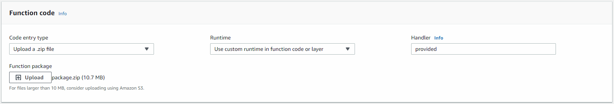

#  LambdaNative Example

This example shows what's necessary to convert an existing Lambda function into a LambdaNative function and how to build a native executable from it using [CoreRT](https://github.com/dotnet/corert).  

# NuGet Packages

There are two NuGet packages involved. The first is `LambaNative` itself, which is easy to install.

```bash
> dotnet add package LambdaNative
```

The second is `Microsoft.DotNet.ILCompiler` which is CoreRT. Currently, this is not on the public NuGet feed. Instead, we need to configure NuGet to fetch it from the `dotnet-core` MyGet feed.

```
https://dotnet.myget.org/F/dotnet-core/api/v3/index.json
```

This is done using a `nuget.config` file like [the one](nuget.config) in this directory. With this file, you'll be able to install `Microsoft.DotNet.ILCompiler`.

```bash
> dotnet add package Microsoft.DotNet.ILCompiler -v 1.0.0-alpha-* 
```

`LambdaNative` does not depend on `Microsoft.DotNet.ILCompiler` directly so you can take advantage of newer versions without delay.

# Project Type

Your project needs to target `netcoreapp2.1` and have `Exe` as its output type.

```xml
<PropertyGroup>
  <TargetFramework>netcoreapp2.1</TargetFramework>
  <OutputType>Exe</OutputType>
</PropertyGroup>
```

# Runtime Directives

To minimize compile time and executable size, CoreRT does not include the type metadata needed for reflection.  

Reflection is needed for serializing and deserializing input/output types. You need to use an `rd.xml` file to let CoreRT know which types to generate metadata for.

You'll see a `MissingMetadataException` if you forget to include a type that gets reflected on. 

Microsoft provide a [tool and more information](https://dotnet.github.io/native/troubleshooter/type.html) on this topic. The tool uses a slightly different format to CoreRT's file, so use [the one](rd.xml) in this directory as a guide.

**Note:** When compiling, you'll receive a warning saying the `rd.xml` format is going to change before release. There's more information on that [here](https://github.com/dotnet/corert/issues/5001).


# Entry Point

Your project needs an entry point (a `Main` method) so it can be compiled into an executable. The entry point will also tell LambdaNative which class will handle executions. In this example, the entry point is [`EntryPoint.cs`](EntryPoint.cs).

The `Main` method only needs to call either `Run` or `RunAsync`.

```csharp
void Run<THandler, TInput, TOutput>()
     where THandler : IHandler<TInput, TOutput>, new()

void RunAsync<THandler, TInput, TOutput>()
     where THandler : IAsyncHandler<TInput, TOutput>, new()
```

# Handler

You can use your existing handler code, but you need to implement either `IHandler<TInput, TOutput>` or `IAsyncHandler<TInput, TOutput>`.

Both of these interfaces have an input and output. If you don't need one, it's best to replace it with a `System.IO.Stream`. In future, LambdaNative could provide more interfaces to do this for you.


# Serializer

If you're using an input/output type other than `System.IO.Stream`, you'll need to configure a serializer. Normally, you'd do this using an assembly attribute.

```csharp
[assembly:LambdaSerializer(typeof(Amazon.Lambda.Serialization.Json.JsonSerializer))]
```

Instead, the handler interfaces inherit from `IHandler` which adds a `Serializer` property.

```csharp
public ILambdaSerializer Serializer => new Amazon.Lambda.Serialization.Json.JsonSerializer();
```

# Compiling

The best environment to compile in would be one built on top of the underlying AWS Lambda excution environment, which runs an Amazon Linux AMI ([amzn-ami-hvm-2017.03.1.20170812-x86_64-gp2](https://console.aws.amazon.com/ec2/v2/home#Images:visibility=public-images;search=amzn-ami-hvm-2017.03.1.20170812-x86_64-gp2)).

Essentially, you need `.NET SDK 2.1.503` and `clang 3.9`. Having said that, CoreRT's prerequisites for building, which can be found [here](https://github.com/dotnet/corert/blob/master/samples/prerequisites.md), gives instructions for using Ubuntu 14.04+. This works well and is easier to get started with.

Here are instructions on how to compile the example project on Ubuntu using EC2.

 * Create a new instance using the [Ubuntu 18.04 AMI with .NET Core 2.1](https://console.aws.amazon.com/ec2/v2/home#Images:visibility=public-images;search=ubuntu-bionic-18.04-amd64-server-20180522-dotnetcore-2018.07.11).
 * SSH into the instance using the `ubuntu` user and your private key.
 * Install clang and other development packages
```bash
> sudo apt-get install clang-3.9 libcurl4-openssl-dev zlib1g-dev libkrb5-dev -y
```
 * Update the .NET Core SDK to `2.1.503`
```bash
> wget -q https://packages.microsoft.com/config/ubuntu/18.04/packages-microsoft-prod.deb
> sudo dpkg -i packages-microsoft-prod.deb
> sudo add-apt-repository universe
> sudo apt-get install apt-transport-https
> sudo apt-get update
> sudo apt-get install dotnet-sdk-2.1 -y
```
 * Clone the LambdaNative repository
```bash
> git clone https://github.com/zaccharles/lambda-native.git
> cd lambda-native/example
```
 * Restore packages, build, and run tests
```bash
> dotnet restore && dotnet build && dotnet test
```
 * Run the build command and copy the executable (`./build.sh`)
```bash
> dotnet publish -r linux-x64 -c release
> cp bin/release/netcoreapp*/linux-x64/native/* bootstrap
```

You now have a native executable file named `bootstrap`.

# Compiling with Docker (For Non-Linux User)

* Create Docker image
```bash
sh build-docker.sh
```
* Run script to compile
```bash
sh build.sh
```

And we have `package.zip` in folder `publish` for ready to deploy

# Deployment

Now that you have a native executable named `bootstrap`, you can deploy it to AWS Lambda. It's important that the file is named `bootstrap` as this is a convention that lets AWS Lambda know which file to execute.  

Follow one of the two steps based on whether you're using the [Serverless framework](https://serverless.com/) or want to do things manually.

### **Serverless**
 * Create a .zip file named `package.zip` in the example directory
 * Add `bootstrap` to the .zip file
 * Run `serverless deploy`

### **Manual (via the AWS Console)**
 * Create a .zip file named `package.zip`
 * Add `bootstrap` to the .zip file
 * Go to the Lambda service in the AWS Console
 * Click on [Create function](https://eu-west-1.console.aws.amazon.com/lambda/home?region=eu-west-1#/create)
 * Ensure `Author from scratch` is selected
 * **Name:** Name the function anything, such as `lambda-native-example`
 * **Runtime:** Select `Use custome runtime in function code or layer` (at the bottom of the list)
 * **Role:** Choose an existing role or create a new one (the example doesn't need any special policies)
 * Click `Create function`
 * Scroll down to Function code...
 * **Code entry type:** Select `Upload a .zip file`
 * Click `Upload` and select `package.zip`
 * (Optional) **Handler:** Change to anything, it doesn't matter. I like `provided`
 * Click `Save` at the top of the page.



### **Testing**
No matter which deployment option you chose, you now have a new function. To test it, click on `Test` at the top of the page.

The first time you do this, you'll need to configure a test event. The `Hello World` template will already be selected, which is what the example expects. Give the event a name, any name, and and click `Create`. You'll need to click `Test` again.

#### Common Problems:
**/var/task/bootstrap: permission denied**  
```json
{
  "errorType": "Runtime.ExitError",
  "errorMessage": "RequestId: 2116dccb-b137-4079-8c59-c3a66ac112f1 Error: Runtime failed to start: fork/exec /var/task/bootstrap: permission denied"
}
```
This occurs when the `bootstrap` file isn't executable. Usually this will happen if you copied the file over the internet (especially to a Windows machine) before zipping it.

Running `chmod +x bootstrap` will fix this, but the easiest thing to do is to create the .zip file straight away after building. If you followed by EC2/Ubuntu instructions above, you can do the following in the example directory:
```bash
> sudo apt install zip -y
> zip package.zip bootstrap
```
Then upload the package again, or run `serverless deploy` again, before testing again.

# Debugging
You can compile and deploy your project just like you normally would. You could also add a separate entry point into your handler for local testing.

There is also the option to set the `LAMBDA_NATIVE_DEBUG` environment variable which will cause LambdaNative to log what it does to CloudWatch.

In future, a fake Lambda Runtime API could be developed to assist with local testing.